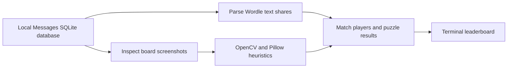

# Wordle iMessage Tracker

A local Python utility that builds a two-player Wordle leaderboard from macOS Messages text shares and cropped board screenshots. It replaces manually comparing results scattered through a conversation.

## How it works



The implementation is in `wordle_script.py`. It loads local configuration, queries Messages data, extracts scores and groups results for comparison. Dependencies are NumPy, OpenCV and Pillow; SQLite access uses Python standard-library support.

## Local setup

Use macOS and Python 3.9 or newer. Run these commands from the repository directory:

```bash
python3 -m venv .venv
source .venv/bin/activate
python -m pip install -r requirements.txt
cp .env.example .env
python wordle_script.py
```

Before running the script, edit `.env` with the player names, second player handle and optional database path documented in `.env.example`. Environment variables can also supply these values.

Reading `~/Library/Messages/chat.db` may require macOS Full Disk Access for the terminal. Review that permission before granting it; it allows broad filesystem access.

## Limitations

- Requires locally available macOS Messages data and attachments.
- Screenshot interpretation uses heuristics and may misread different crops, layouts or themes.
- Player matching is designed for the current two-player use case.
- Date handling uses an America/New_York timezone and a configured puzzle-date anchor in the script.
- This is a personal local utility, not a hosted service; there is no automated test suite in this repository.

## Privacy and demos

Do not commit Messages databases, exported attachments, real message screenshots or `.env`. The repository supplies placeholder configuration and ignores common private files. Screenshot rows are labeled `[screenshot attachment]` rather than printing attachment filenames.

Use synthetic data for a public demo. Review terminal output before sharing it because player names and results can identify people.
